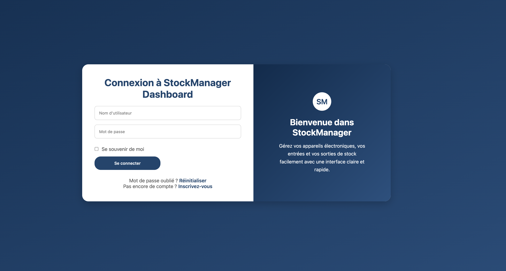
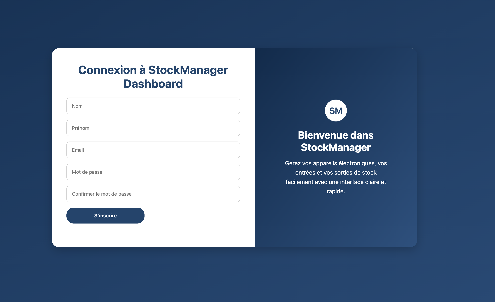
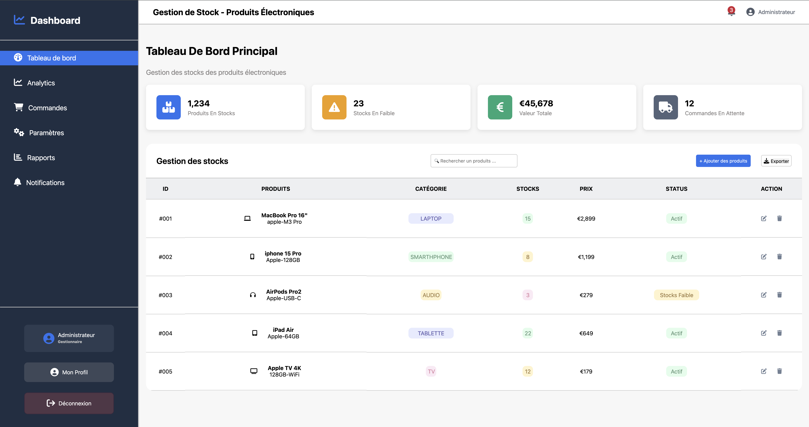
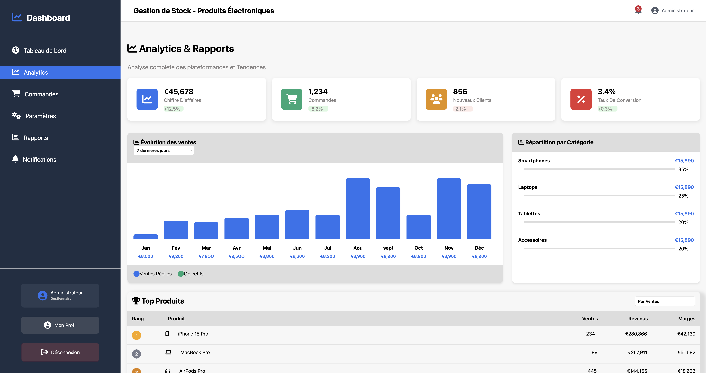
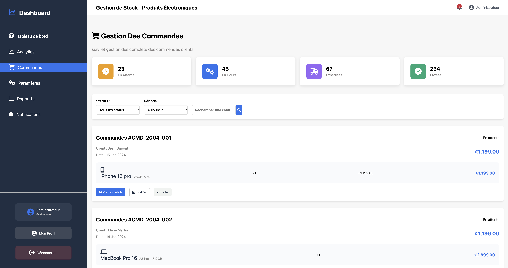
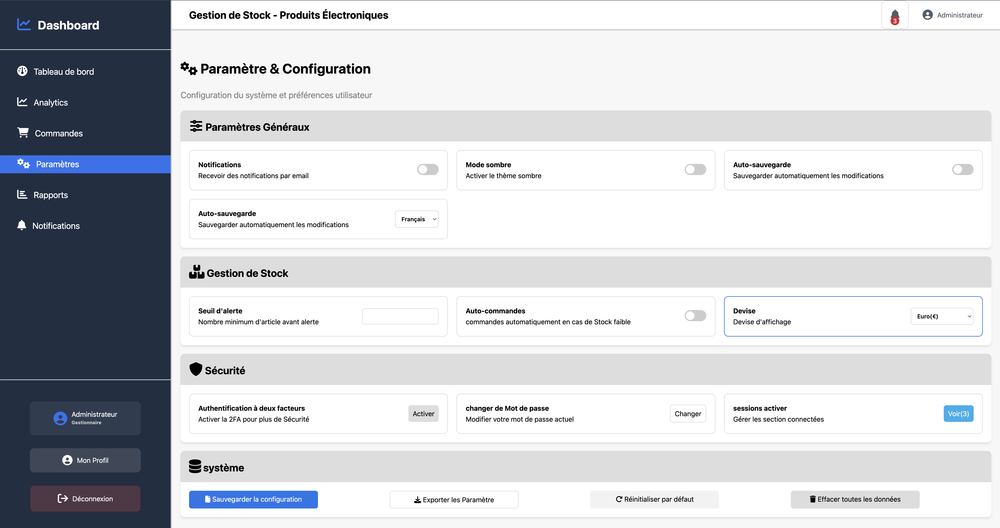
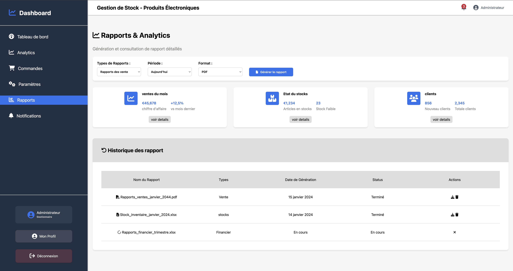
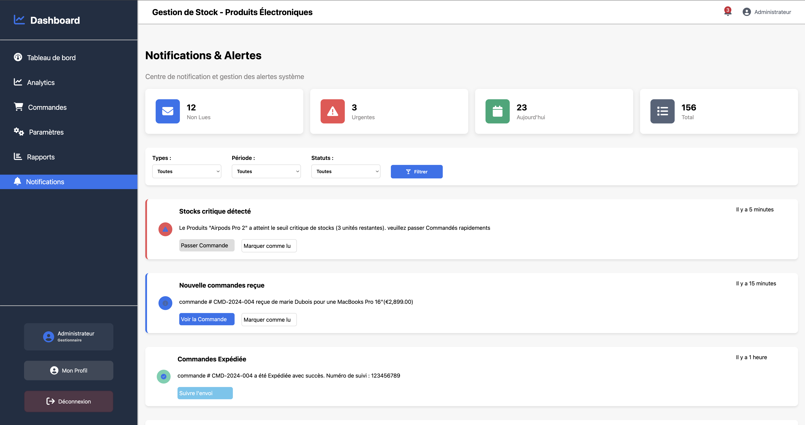

# Projet : Dashboard HTML & CSS
## Description

- Ce projet marque l’aboutissement de mon parcours en HTML et CSS.
- Il me permet de mettre en pratique l’ensemble de mes acquis, de consolider mes compétences et de démontrer ma maîtrise du développement web front-end.
## Objectif
L’objectif est de concevoir un dashboard moderne, fluide et professionnel, tout en appliquant les bonnes pratiques de conception : structure claire, design responsive et sens du détail.

## Objectifs pédagogiques

Structurer une page web complète avec HTML5

Styliser et organiser les éléments avec CSS3

Utiliser Flexbox et/ou CSS Grid pour la mise en page

Créer une interface responsive et esthétique

Mettre en valeur la cohérence visuelle et la créativité

## Technologies utilisées

- HTML5 : pour la structure et le contenu du dashboard

- CSS3 : pour la mise en forme, les animations et la disposition

- Google Fonts / Icônes pour enrichir le design

### Contenu du projet

Le dashboard contient :

- Une barre de navigation (header ou topbar)

- Un menu latéral (sidebar)

- Une zone de contenu principale affichant des cartes, graphiques ou statistiques

- Un style harmonieux, avec couleurs, typographie et espacements cohérents

## Fonctionnalités visuelles

- Interface responsive (adaptée aux différents écrans)

- Effets au survol (hover) pour rendre l’expérience fluide

- Animations douces pour améliorer la convivialité

- Design minimaliste et professionnel
### Capture

### liens github page
[liens](https://ra-code422.github.io/Stock-Manager/)